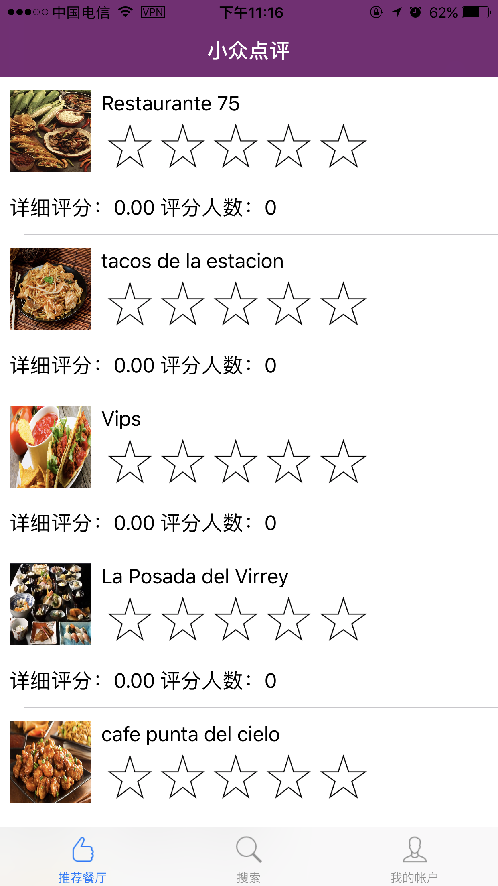
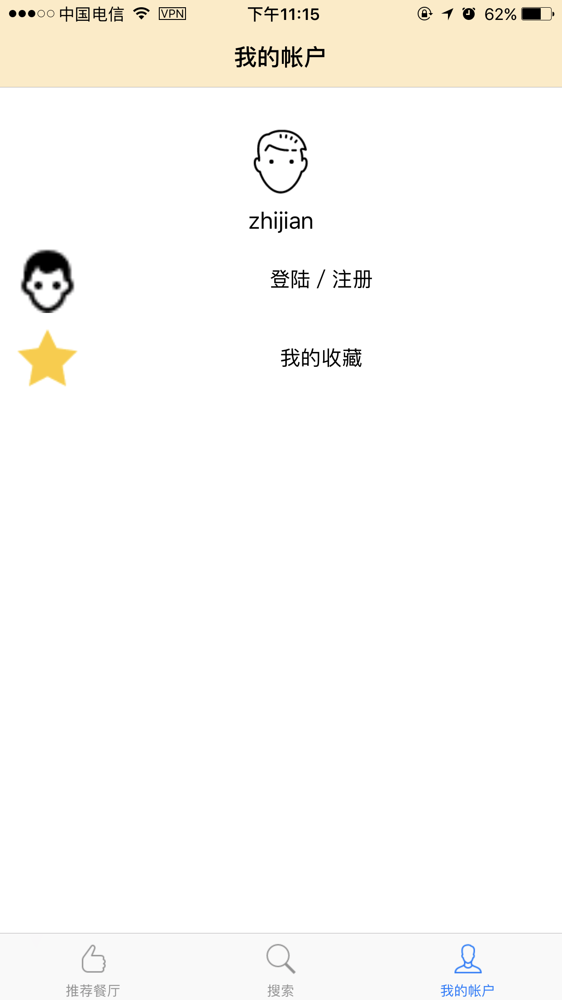
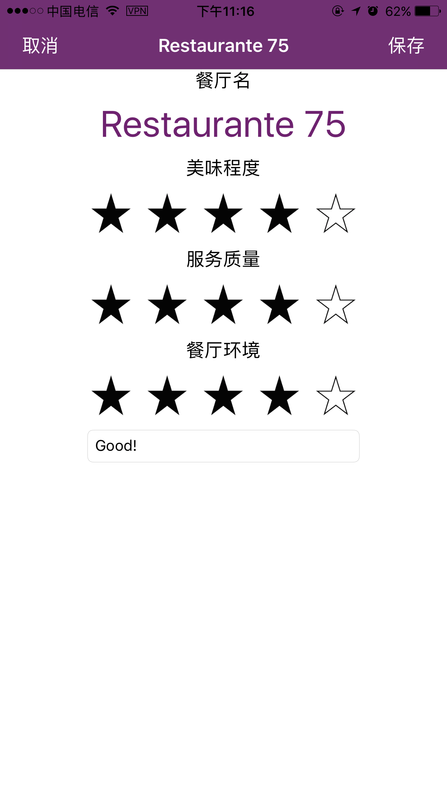
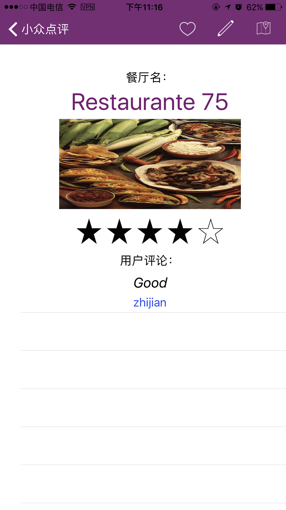

# MinorDianping
This the final project of NJU Mobile Application 2017 Spring by Zhijian Jiang and Zhecheng Li.

## App Introduction 介绍 
MinorDianping is an iOS application inspired by DazhongDianping in China (or Yelp in U.S.), an application for restaurants recommendation. Our application has following functions: searching, recommending, grading, locating restaurants and navigating. Also, it allows users to log in and sign up.  
MinorDianping是一款受大众点评启发的、美食推荐类App。该App有餐厅推荐、餐厅评分、餐厅定位与导航、餐厅搜索、用户登录等功能组成。

## Contributors
* [Zhecheng Li](https://github.com/BearL222)
	* designed and implemented UI
	* implemented functions like user login and signup, commenting, grading, searching and collecting restaurants.
	* 设计与实现UI
	* 用户登录和注册、餐厅的评论和打分、餐厅搜索、餐厅收藏等功能
	
* [Zhijian Jiang](https://github.com/ZhijianJiang)
	* implemented long-time storage with Core Data
	* Deployed remote server and coded for server and server API in Swift
	* 使用Core Data实现持久化存储
	* 部署远程服务器的，编写服务器端代码和服务器的swift接口
	
## Demo

Recommending restaurants tab.  
A list of restaurants with their names, images, grades, number of people who have graded.

Search tab.  
You can search with one or more words with two searching types.

Account View.  
You can login or signup.

Login tab.  
You can login or see all your restaurants collections.

After login, you can grade the restaurants for taste, service and environment.

You can see comments from others.
